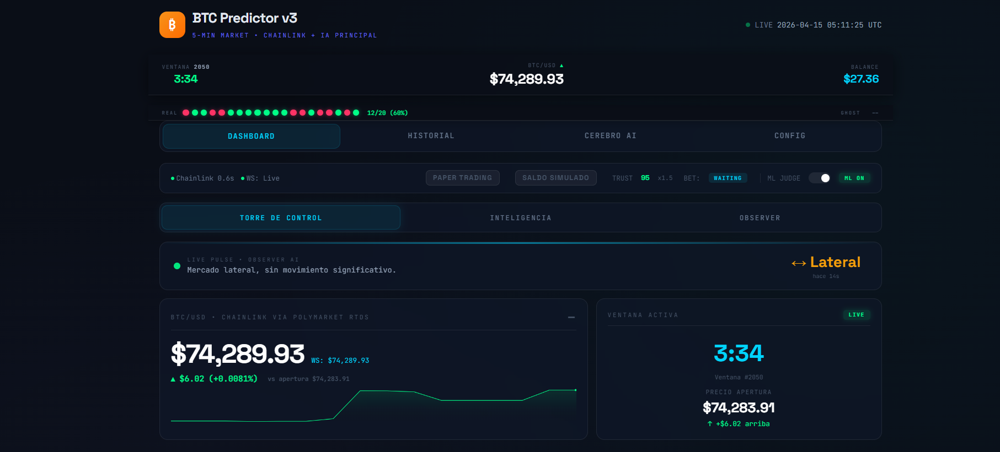

# BTC5min — Predictor de Bitcoin a 5 minutos con IA multi-agente

> 🇪🇸 **Español** · [🇬🇧 English below](#english-version)

> 🤖 **Creado con [Claude Code](https://claude.com/claude-code) (Anthropic)** con fines puramente educativos y de investigación.
>
> 🧠 **IA probada en producción: [DeepSeek API](https://platform.deepseek.com)** — elegida por su excelente relación costo/calidad (≈10-20× más barata que GPT-4/Claude manteniendo razonamiento competitivo para trading cuantitativo). **Costo real medido: ~$0.30 USD/día corriendo 24/7** (≈$9/mes). El sistema es *provider-agnostic*: puedes sustituirla por Anthropic, OpenAI o un LLM local sin tocar código.



---

## ⚠️ AVISO LEGAL — Propósito Educativo

Este proyecto es **exclusivamente con fines educativos y de investigación**.

- **NO** es asesoría financiera.
- **NO** garantiza ganancias de ningún tipo.
- El trading de criptomonedas y mercados binarios conlleva **riesgo alto de pérdida total del capital**.
- El proyecto puede configurarse para apostar **dinero real (USDC) en Polymarket** mediante el modo `live_mainnet`. Si decides activarlo, lo haces **bajo tu propia y exclusiva responsabilidad**. Los autores no se hacen responsables de ningún tipo de pérdida.
- Por defecto arranca en modo `offline_sim` (simulación local, cero órdenes reales).

Usa este código para **aprender** sobre IA aplicada, análisis técnico, ejecución en DEX, RAG, ML y sistemas multi-agente — no como máquina de hacer dinero.

---

## ¿Qué es BTC5min?

BTC5min es un predictor autónomo de la dirección del precio del BTC en ventanas de 5 minutos que opera (o simula operar) en los mercados binarios `BTC Up/Down 5m` de **Polymarket**. Integra:

- **Multi-agente de IA**: DeepSeek, Anthropic Claude, OpenAI GPT y LLMs locales (LM Studio/Ollama) corriendo en paralelo, cada uno con portfolio y prompt independiente.
- **Smart Money Concepts (SMC)**: detección en vivo de FVG, BOS/CHoCH, Order Blocks, liquidity sweeps, Kill Zones.
- **22 indicadores técnicos**: RSI, EMA 9/21, MACD, Bollinger, ATR, S/R, momentum, volumen, Bollinger %B.
- **RAG con ChromaDB**: 19 estrategias institucionales (Wyckoff, ICT, Elliott, Volume Profile, etc.) recuperadas por similitud coseno según contexto de mercado.
- **ML Judge (XGBoost)** como filtro de apuestas, opcional **LSTM temporal** y **HMM de régimen**.
- **Sniper Consensus** con decaimiento de confianza por tiempo y variantes (Early-Flash, Flash-Fire, Consensus, Rescue, Override).
- **Kelly Criterion** con trust-score adaptativo, circuit breakers de noticias/liquidaciones, y auto-bailout.
- **Feeds en tiempo real**: precio Chainlink (vía Polymarket RTDS) + Binance fallback, CVD intra-candle, GEX de Deribit, order book, liquidaciones.
- **Ejecución nativa** en Polymarket CLOB (Polygon L2) con `py-clob-client`, Maker Ladder (3 rungs), filtros PTB, Survival Shields (Profit-Lock y Flip-Stop).

## Quick Start

```bash
# 1. Clonar
git clone https://github.com/TU_USUARIO/btc5min.git
cd btc5min

# 2. Entorno virtual (Python 3.11+)
python -m venv .venv
.venv\Scripts\activate            # Windows
# source .venv/bin/activate       # Linux/Mac

# 3. Dependencias
pip install -r requirements.txt

# 4. Configurar variables (copiar plantilla y editar)
copy env.example .env             # Windows
# cp env.example .env             # Linux/Mac

# 5. Arrancar (modo simulación por defecto)
python app.py
# Dashboard: http://localhost:5000
```

## Modos de Operación

| Modo | Qué hace | Requiere |
|---|---|---|
| `offline_sim` (**default**) | Simulación 100% local en SQLite. Cero órdenes reales. | Solo una API key de IA |
| `paper_simmer` | Alias legacy de `offline_sim` | Ídem |
| `live_mainnet` | **Órdenes reales con USDC en Polymarket CLOB (Polygon)** | `WALLET_PRIVATE_KEY` + `POLYMARKET_PROXY_FUNDER` |

Setear en `.env`: `TRADING_MODE=live_mainnet` para activar modo real.

⚠️ **Antes de poner modo live**: corre días en `offline_sim`, entrena el Judge XGBoost con tus propios datos, valida walk-forward, y sobre todo **entiende qué hace cada componente**.

## Variables de Entorno

| Variable | Obligatoria | Descripción |
|---|---|---|
| `DEEPSEEK_API_KEY` | Sí (o alguna otra) | Proveedor de IA primario |
| `ANTHROPIC_API_KEY` | Opcional | Claude en el swarm |
| `OPENAI_API_KEY` | Opcional | GPT en el swarm |
| `LOCAL_LLM_URL` | Opcional | LM Studio/Ollama (default `http://localhost:1234/v1`) |
| `TRADING_MODE` | No | `offline_sim` (default) / `live_mainnet` |
| `BTC5MIN_API_KEY` | **Recomendada** | Protege endpoints POST de la API |
| `BTC5MIN_HOST` | No | Bind address (default `127.0.0.1`) |
| `WALLET_PRIVATE_KEY` | Solo live | Private key de tu wallet en Polygon |
| `POLYMARKET_PROXY_FUNDER` | Solo live | Proxy funder address de Polymarket |

## Configuración Dinámica

Todo lo "hot-reloadable" vive en `dynamic_rules.json` o se edita desde el panel `Config` de la UI web:

- Agentes del swarm (prompts, proveedor, habilitado/deshabilitado)
- Umbrales del Sniper (EV, confidence decay, cutoffs)
- Parámetros del ML Judge, PTB Filter, Maker Ladder
- Reglas de meta-swarm consensus y second opinion

Sin reiniciar la app.

## Arquitectura del Proyecto

```
btc5min/
├── app.py                         # Entry point
├── btc5min/
│   ├── engine.py                  # Coordinador principal (zero-drift tick loop)
│   ├── config.py / config_manager.py
│   ├── database.py                # SQLite WAL + write-worker
│   ├── models.py                  # Dataclasses
│   ├── routes.py                  # Flask + API REST
│   ├── data_feeds/                # Chainlink, Binance, Polymarket, Deribit
│   ├── ai/                        # ai_engine, swarm, rag_db, local_llm
│   ├── analysis/                  # technical, smc_features, regime_hmm
│   ├── sentiment/                 # Fear & Greed + RSS + circuit breaker
│   ├── execution/                 # clob_executor, ladder, ptb_filter, survival
│   ├── observability/             # Prometheus metrics
│   ├── risk/                      # Kelly, límites diarios, RL wrapper
│   └── strategies/                # Prompts + RAG JSON
├── ml/                            # Training (XGBoost, LSTM, HMM, RL, walk-forward)
├── scripts/                       # Utilidades (clean_db, coliseum, context)
├── templates/                     # Dashboard, history, brain, config (HTML)
├── dynamic_rules.json             # Hot-reload
└── models/ data/ logs/            # Artefactos (gitignoreados)
```

Cada subsistema tiene su propio `CLAUDE.md` con el detalle. El documento raíz `CLAUDE.md` es la fuente de verdad de la arquitectura.

## Lógica del Motor (resumen)

1. **Tick loop cada 2s** con sincronización absoluta al reloj (ventanas abren exactamente en :00, :05, :10… UTC con jitter <50ms).
2. **T+0**: se abre ventana, se genera predicción primaria + se "arman" agentes del swarm.
3. **T+15s a T+235s**: el **Sniper Consensus** re-evalúa con pura TA (sin costo de API) hasta que aparece una señal ejecutable.
4. **Triggers**: `EARLY-FLASH` (EV>1.30), `FLASH-FIRE` (EV>1.18), `CONSENSUS` (score-based), `RESCUE` (cutoff T+235), `OVERRIDE` (meta-swarm unánime).
5. **Filtros antes de ejecutar**: ML Judge (XGBoost), Trust-Gate, PTB Filter (strike vs spot), Circuit Breakers (noticias/liquidaciones).
6. **Ejecución**: Maker Ladder con 3 rungs en CLOB, post-only GTC.
7. **Resolución a T+300**: oracle Chainlink (o Binance fallback) decide outcome, se actualiza portfolio y se dispara **reflexión epistémica** si fue pérdida.
8. **Rotación**: estrategia RAG en blacklist tras 7 pérdidas o 2h; agentes del swarm rotan prompt (fatigue personas).

## Entrenamiento ML

```bash
# Generar dataset desde SQLite
python -m ml.generate_dataset

# XGBoost Judge (filtro primario)
python -m ml.train_xgboost_judge

# Validación walk-forward temporal
python -m ml.train_walkforward

# Opcionales
python -m ml.train_lstm_judge    # PyTorch
python -m ml.train_hmm_regime    # hmmlearn
python -m ml.train_rl_agent      # stable-baselines3
```

## RAG — Estrategias Institucionales

```bash
# Carga inicial / re-ingesta
python -m btc5min.ai.ingestar_rag
```

Las 19 estrategias viven en `btc5min/strategies/rag/*.json`. ChromaDB con embeddings multilingual.

## Seguridad

- **Nunca commitees `.env`** — está en `.gitignore`.
- Setea `BTC5MIN_API_KEY` para proteger los endpoints POST.
- Bind default `127.0.0.1` (solo localhost). Cambia `BTC5MIN_HOST=0.0.0.0` solo detrás de firewall.
- Los `.pkl`/`.joblib` usan `pickle` — carga solo artefactos que tú mismo entrenaste.
- Para modo live: usa **wallets dedicadas**, nunca tu wallet principal.

## Tech Stack

- **Backend**: Python 3.11+, Flask 3
- **IA**: DeepSeek · Anthropic · OpenAI · LM Studio/Ollama
- **ML**: XGBoost · scikit-learn · PyTorch (LSTM) · hmmlearn · stable-baselines3
- **Datos**: Chainlink (Polymarket RTDS) · Binance WS · Deribit
- **Ejecución**: `py-clob-client` (Polymarket CLOB on Polygon L2)
- **Vector DB**: ChromaDB + `paraphrase-multilingual-MiniLM-L12-v2`
- **Observabilidad**: Prometheus + Grafana (opcional)

## Licencia

MIT — ver [LICENSE](LICENSE).

---
---

<a id="english-version"></a>
# BTC5min — AI Multi-Agent Bitcoin 5-Minute Predictor (English)

> 🤖 **Built with [Claude Code](https://claude.com/claude-code) (Anthropic)** for purely educational and research purposes.
>
> 🧠 **AI tested in production: [DeepSeek API](https://platform.deepseek.com)** — chosen for its strong cost/quality ratio (~10-20× cheaper than GPT-4/Claude while keeping competitive reasoning for quantitative trading). **Measured real cost: ~$0.30 USD/day running 24/7** (≈$9/month). The system is *provider-agnostic*: you can swap it for Anthropic, OpenAI or a local LLM without touching code.


## ⚠️ DISCLAIMER — Educational Purpose

This project is provided **for educational and research purposes only**.

- This is **NOT** financial advice.
- No profits are guaranteed. Ever.
- Crypto trading and binary options carry a **high risk of total capital loss**.
- The project **can be configured to place real USDC bets on Polymarket** via `live_mainnet` mode. If you choose to enable this, you do so **entirely at your own risk**. The authors accept no liability for any loss.
- The default mode is `offline_sim` (local simulation, zero real orders).

Use the codebase to **learn** about applied AI, technical analysis, DEX execution, RAG, ML and multi-agent systems — not as a money printer.

---

## What is BTC5min?

BTC5min is an autonomous predictor of BTC price direction over 5-minute windows that trades (or simulates trading) the `BTC Up/Down 5m` binary markets on **Polymarket**. It integrates:

- **Multi-agent AI**: DeepSeek, Anthropic Claude, OpenAI GPT and local LLMs (LM Studio/Ollama) running in parallel, each with its own portfolio and prompt.
- **Smart Money Concepts (SMC)**: live detection of FVG, BOS/CHoCH, Order Blocks, liquidity sweeps, Kill Zones.
- **22 technical indicators**: RSI, EMA 9/21, MACD, Bollinger, ATR, S/R, momentum, volume, %B.
- **RAG with ChromaDB**: 19 institutional strategies (Wyckoff, ICT, Elliott, Volume Profile, etc.) retrieved by cosine similarity against market context.
- **ML Judge (XGBoost)** as a bet filter, optional **temporal LSTM** and **HMM regime detector**.
- **Sniper Consensus** with time-based confidence decay and variants (Early-Flash, Flash-Fire, Consensus, Rescue, Override).
- **Kelly Criterion** with adaptive trust score, news/liquidation circuit breakers, and auto-bailout.
- **Real-time feeds**: Chainlink price (via Polymarket RTDS) with Binance fallback, intra-candle CVD, Deribit GEX, order book, liquidations.
- **Native execution** on Polymarket CLOB (Polygon L2) via `py-clob-client`, Maker Ladder (3 rungs), PTB filters, Survival Shields (Profit-Lock & Flip-Stop).

## Quick Start

```bash
git clone https://github.com/YOUR_USERNAME/btc5min.git
cd btc5min

python -m venv .venv
source .venv/bin/activate           # Linux/Mac
# .venv\Scripts\activate            # Windows

pip install -r requirements.txt
cp env.example .env                 # edit with your keys

python app.py
# Dashboard: http://localhost:5000
```

## Trading Modes

| Mode | Behavior | Requires |
|---|---|---|
| `offline_sim` (**default**) | 100% local SQLite simulation. No real orders. | Just an AI API key |
| `paper_simmer` | Legacy alias for `offline_sim` | Same |
| `live_mainnet` | **Real USDC orders on Polymarket CLOB (Polygon)** | `WALLET_PRIVATE_KEY` + `POLYMARKET_PROXY_FUNDER` |

Set `TRADING_MODE=live_mainnet` in `.env` to enable live mode.

⚠️ **Before going live**: run for days in `offline_sim`, train the XGBoost Judge on your own data, validate walk-forward, and most importantly **understand what each component does**.

## Environment Variables

| Variable | Required | Description |
|---|---|---|
| `DEEPSEEK_API_KEY` | Yes (or another) | Primary AI provider |
| `ANTHROPIC_API_KEY` | Optional | Claude swarm agents |
| `OPENAI_API_KEY` | Optional | GPT swarm agents |
| `LOCAL_LLM_URL` | Optional | LM Studio/Ollama (default `http://localhost:1234/v1`) |
| `TRADING_MODE` | No | `offline_sim` (default) / `live_mainnet` |
| `BTC5MIN_API_KEY` | **Recommended** | Protects POST endpoints |
| `BTC5MIN_HOST` | No | Bind address (default `127.0.0.1`) |
| `WALLET_PRIVATE_KEY` | Live only | Polygon wallet private key |
| `POLYMARKET_PROXY_FUNDER` | Live only | Polymarket proxy funder address |

## Dynamic Configuration

All hot-reloadable parameters live in `dynamic_rules.json` or can be edited from the web UI `Config` panel:

- Swarm agents (prompts, provider, enabled/disabled)
- Sniper thresholds (EV, confidence decay, cutoffs)
- ML Judge, PTB Filter, Maker Ladder parameters
- Meta-swarm consensus and second-opinion rules

No restart needed.

## Architecture

```
btc5min/
├── app.py                         # Entry point
├── btc5min/
│   ├── engine.py                  # Main coordinator (zero-drift tick loop)
│   ├── config.py / config_manager.py
│   ├── database.py                # SQLite WAL + write-worker queue
│   ├── models.py                  # Dataclasses
│   ├── routes.py                  # Flask + REST API
│   ├── data_feeds/                # Chainlink, Binance, Polymarket, Deribit
│   ├── ai/                        # ai_engine, swarm, rag_db, local_llm
│   ├── analysis/                  # technical, smc_features, regime_hmm
│   ├── sentiment/                 # Fear & Greed + RSS + circuit breaker
│   ├── execution/                 # clob_executor, ladder, ptb_filter, survival
│   ├── observability/             # Prometheus metrics
│   ├── risk/                      # Kelly, daily limits, RL wrapper
│   └── strategies/                # Prompts + RAG JSON
├── ml/                            # Training (XGBoost, LSTM, HMM, RL, walk-forward)
├── scripts/                       # Utilities (clean_db, coliseum, context)
├── templates/                     # Dashboard, history, brain, config (HTML)
├── dynamic_rules.json             # Hot-reload
└── models/ data/ logs/            # Artifacts (gitignored)
```

Each subsystem has its own `CLAUDE.md` detailing internals. Root `CLAUDE.md` is the architecture source of truth.

## Engine Logic (summary)

1. **2s tick loop** with absolute clock sync — windows open exactly at :00, :05, :10 UTC (<50ms jitter).
2. **T+0**: window opens; primary prediction fires + swarm agents are "armed".
3. **T+15s → T+235s**: **Sniper Consensus** re-evaluates using pure TA (no API cost) until a tradeable signal appears.
4. **Triggers**: `EARLY-FLASH` (EV>1.30), `FLASH-FIRE` (EV>1.18), `CONSENSUS` (score-based), `RESCUE` (cutoff T+235), `OVERRIDE` (unanimous meta-swarm).
5. **Pre-execution filters**: ML Judge (XGBoost), Trust Gate, PTB Filter (strike vs spot), Circuit Breakers (news/liquidations).
6. **Execution**: 3-rung Maker Ladder on CLOB, post-only GTC.
7. **Resolution at T+300**: Chainlink oracle (Binance fallback) decides outcome; portfolio updates; on loss, async **epistemic reflection** diagnoses root cause.
8. **Rotation**: RAG strategy blacklisted after 7 losses or 2h age; swarm agents rotate fatigue persona prompts.

## ML Training

```bash
python -m ml.generate_dataset         # Dataset from SQLite
python -m ml.train_xgboost_judge      # Primary bet filter
python -m ml.train_walkforward        # Temporal validation
python -m ml.train_lstm_judge         # Optional (PyTorch)
python -m ml.train_hmm_regime         # Optional (hmmlearn)
python -m ml.train_rl_agent           # Optional (stable-baselines3)
```

## RAG — Institutional Strategies

```bash
python -m btc5min.ai.ingestar_rag     # Initial / re-ingest
```

The 19 strategies live under `btc5min/strategies/rag/*.json`, stored in ChromaDB with multilingual embeddings.

## Security

- **Never commit `.env`** — it's in `.gitignore`.
- Set `BTC5MIN_API_KEY` to protect POST endpoints.
- Default bind is `127.0.0.1` (localhost only). Change `BTC5MIN_HOST=0.0.0.0` only behind a firewall.
- `.pkl` / `.joblib` files use `pickle` — only load artifacts you trained yourself.
- For live mode: use a **dedicated wallet**, never your main wallet.

## Tech Stack

- **Backend**: Python 3.11+, Flask 3
- **AI**: DeepSeek · Anthropic · OpenAI · LM Studio/Ollama
- **ML**: XGBoost · scikit-learn · PyTorch (LSTM) · hmmlearn · stable-baselines3
- **Data**: Chainlink (Polymarket RTDS) · Binance WS · Deribit
- **Execution**: `py-clob-client` (Polymarket CLOB on Polygon L2)
- **Vector DB**: ChromaDB + `paraphrase-multilingual-MiniLM-L12-v2`
- **Observability**: Prometheus + Grafana (optional)

## License

MIT — see [LICENSE](LICENSE).

---

**Final reminder**: This software is educational. Real money use is at your own risk. Past simulation performance does not guarantee future results. Crypto and prediction markets can and do produce total loss scenarios.
